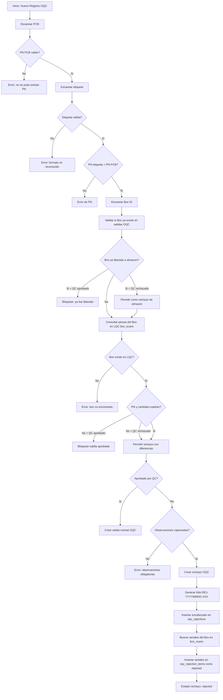
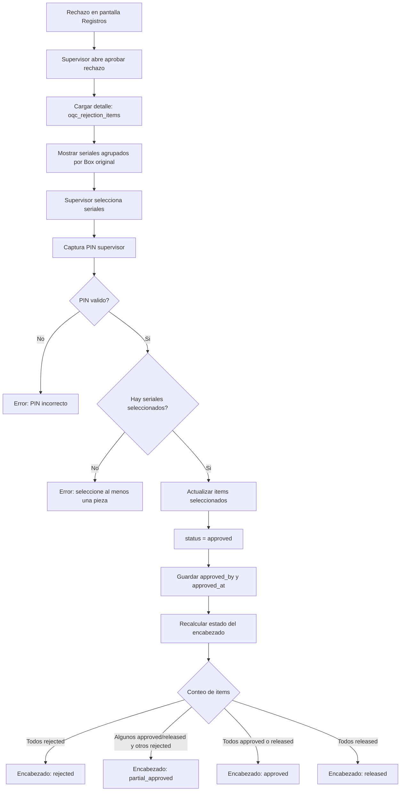
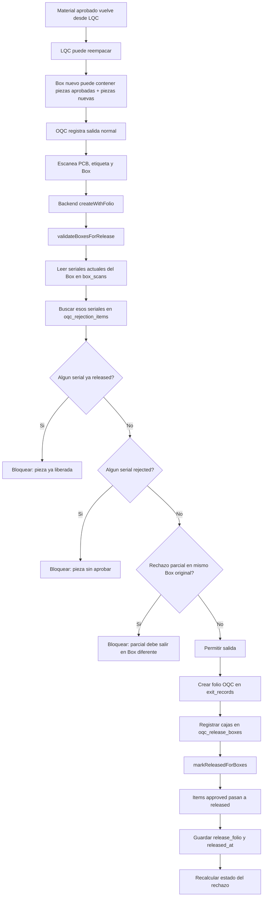
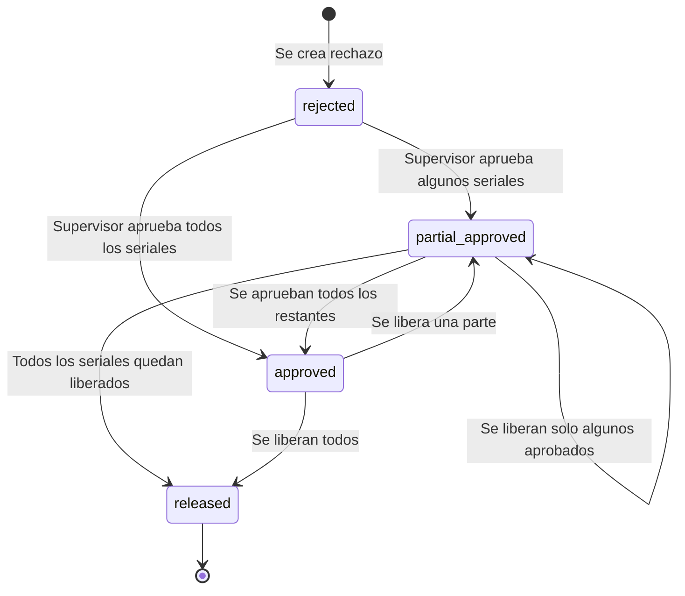

# Flujo de Rechazo OQC

Este documento describe el proceso de rechazo, aprobacion parcial y liberacion de material rechazado en la aplicacion OQC Registro de Salidas.

## Resumen

El proceso separa dos acciones:

- **Aprobacion**: un supervisor autoriza seriales rechazados para que puedan volver a salir.
- **Liberacion**: los seriales aprobados se registran nuevamente como salida OQC y quedan ligados a un folio OQC nuevo.

Una pieza aprobada no esta liberada hasta que vuelve a pasar por el flujo normal de salida.

## Registro Inicial Del Rechazo

## Aprobacion De Rechazo

## Liberacion De Material Aprobado

La liberacion sucede cuando el material aprobado se registra otra vez como una salida OQC normal. No ocurre en el boton de aprobar.

## Estados Del Rechazo

## Significado De Estados

### Encabezado: `oqc_rejections.status`

| Estado | Significado |
| --- | --- |
| `rejected` | El rechazo existe y sus piezas siguen rechazadas. |
| `partial_approved` | Algunas piezas ya fueron aprobadas o liberadas, pero quedan piezas rechazadas. |
| `approved` | Todas las piezas del rechazo estan aprobadas o liberadas, pero no todas han salido de nuevo. |
| `released` | Todas las piezas del rechazo ya fueron liberadas con folio OQC. |

### Detalle: `oqc_rejection_items.status`

| Estado | Significado |
| --- | --- |
| `rejected` | La pieza no puede salir. |
| `approved` | La pieza puede volver a salir por el flujo normal OQC. |
| `released` | La pieza ya salio nuevamente y tiene `release_folio`. |

## Reglas De Liberacion

La validacion permite:

- Liberar una caja con piezas de rechazo `approved`.
- Incluir piezas nuevas o de reemplazo que no aparecen en `oqc_rejection_items`.
- Liberar parcialmente solo las piezas que ya fueron aprobadas.

La validacion bloquea:

- Piezas del rechazo que siguen en `rejected`.
- Piezas que ya estan en `released`.
- Piezas de otro rechazo que todavia no esta aprobado.
- Un rechazo parcial que intenta salir en el mismo Box ID original.

## Ejemplo Operativo

1. Se rechaza una caja con 70 piezas y se genera `REJ-YYYYMMDD-001`.
2. LQC reinspecciona y determina que 20 piezas son recuperables.
3. Supervisor aprueba solo esos 20 seriales.
4. El rechazo queda `partial_approved`.
5. LQC reemplaza las piezas scrap con piezas nuevas para completar la caja.
6. OQC escanea esa caja como salida aprobada.
7. El backend marca los 20 seriales aprobados como `released`.
8. Las piezas nuevas no cambian estado de rechazo porque no pertenecen al rechazo.
9. El rechazo seguira `partial_approved` hasta que todos sus seriales queden aprobados/liberados o se defina otro cierre operativo.
